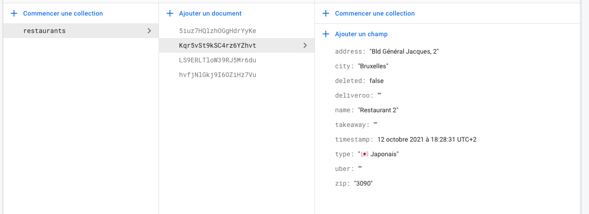

## Project Ionic Ephec

### Commandes pour débuter le projet

1. Installer les packages
````
npm install
````

2. Ajouter ses identifiants firebase dans le dossier /src/environments/environment.ts

Pour obtenir ces identifiants, connectez vous sur https://firebase.google.com avec votre compte Google. Créez un nouveau projet et récupérer les identifiants web. 


Copier les éléments à l'intérieur de ````const firebaseConfig = {```` et coller les dans ````firebase : {}````.

3. Lancer l'application.


````
ionic lab
````

4. Votre navigateur devrait s'ouvrir et vous montrer l'app tourner.

5. Activer Firestore dans votre console Firebase -> Firestore -> Créer une base de données.
6. Sélectionnez "Démarrer en mode test".
7. Ajouter une collection Restaurant et quelques éléments

